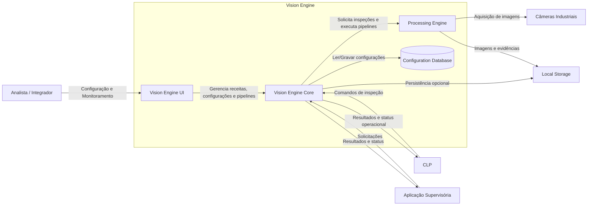

# Vision Engine Discovery

Repositório criado para registrar a atividade de *Discovery Arquitetural Estrutural* do Vision Engine, utilizando engenharia de prompts para obtenção e refinamento de artefatos arquiteturais baseados em IA.

O objetivo do trabalho é transformar uma descrição inicial do sistema em uma representação arquitetural progressivamente refinada, passando por identificação de lacunas, definição de premissas, modelagem de containers e validação das dependências principais do sistema.

---

# Objetivos

- Estruturar o conhecimento inicial do produto.
- Identificar lacunas arquiteturais e decisões ainda não tomadas.
- Consolidar premissas e limites do sistema.
- Gerar diagramas arquiteturais de containers.
- Comparar diferentes formas de representação arquitetural.
- Produzir artefatos reutilizáveis para etapas posteriores de arquitetura.

---

# Estrutura do Repositório

```text
.
├── docs
│   ├── roteiro-revisado.md
│   └── vision-engine-description.md
│
├── outputs
│   ├── 01-structural-discovery-result.md
│   ├── 02-container-diagram.md
│   ├── 02-diagram-mermaid.mmd
│   ├── 02-plant-uml-diagram.puml
│   └── 02-plant-uml-diagram.png
│
└── prompt
    ├── prompt-01.md
    └── prompt-02.md
```

---

# Processo Executado

## Etapa 1 - Discovery Estrutural

A partir da descrição inicial do Vision Engine foi executado um processo de descoberta arquitetural com foco em:

- escopo do sistema;
- limites arquiteturais;
- responsabilidades;
- integrações externas;
- restrições;
- lacunas e ambiguidades.

Como resultado foram identificadas perguntas de esclarecimento e decisões arquiteturais pendentes.

Artefato gerado:

```text
outputs/01-structural-discovery-result.md
```

---

## Etapa 2 - Refinamento do Escopo

Após responder às principais dúvidas identificadas pelo processo de discovery, foi elaborado um roteiro consolidado contendo:

- objetivos do sistema;
- premissas arquiteturais;
- responsabilidades;
- integrações;
- restrições;
- lacunas remanescentes.

Artefato utilizado:

```text
docs/roteiro-revisado.md
```

---

## Etapa 3 - Modelagem de Containers

A partir do roteiro revisado foi gerado um diagrama arquitetural de containers representando:

- Vision Engine UI
- Vision Engine Core
- Processing Engine
- Configuration Database
- Local Storage
- CLP
- Aplicação Supervisória
- Câmeras Industriais

O objetivo foi demonstrar os principais relacionamentos e dependências do sistema sem detalhar aspectos internos de implementação.

Artefato gerado:

```text
outputs/02-container-diagram.md
```

---

# Diagramas

## Visão Geral de Containers

### Mermaid

Arquivo fonte:

```text
outputs/02-diagram-mermaid.mmd
```



### PlantUML

Durante a atividade também foi realizada uma segunda modelagem utilizando PlantUML com o objetivo de comparar legibilidade, organização visual e facilidade de manutenção entre as duas notações.

Arquivos:

```text
outputs/02-plant-uml-diagram.puml
outputs/02-plant-uml-diagram.png
```

Imagem renderizada:

outputs/02-plant-uml-diagram.png

---

# Decisões e Ajustes Realizados

## Definição da Implantação

Foi definido que o Vision Engine será executado localmente em equipamentos industriais Windows, sem considerar neste momento mecanismos centralizados de atualização ou gerenciamento remoto.

## Suporte a Múltiplas Câmeras

Uma única instância do sistema pode operar simultaneamente com múltiplas câmeras industriais.

## Separação entre Core e Processamento

A arquitetura foi dividida em dois containers principais:

- Vision Engine Core
- Processing Engine

Essa divisão visa desacoplar atividades administrativas e de orquestração das rotinas computacionalmente intensivas de visão computacional.

## Interface Própria de Configuração

Foi assumida a existência de uma interface dedicada para:

- configuração de receitas;
- configuração de pipelines;
- monitoramento;
- diagnóstico.

## Persistência de Configurações

Receitas e configurações foram modeladas em um banco de dados local integrado à aplicação.

A tecnologia específica não foi definida nesta etapa.

## Persistência de Imagens

A gravação de imagens e resultados foi considerada opcional e realizada através do sistema de arquivos local.

## Integração Industrial

A comunicação com CLPs foi representada como bidirecional:

- acionamento de inspeções;
- leitura de resultados;
- consulta de status.

Os protocolos específicos permaneceram fora do escopo.

---

# Lacunas Permanecem em Aberto

As seguintes decisões ainda exigem aprofundamento em etapas futuras:

- tecnologia da interface de configuração;
- tecnologia do banco de dados;
- protocolos de comunicação industrial;
- protocolos de integração com aplicações externas;
- estratégia de retenção de imagens;
- versionamento de pipelines;
- mecanismo de distribuição de configurações;
- monitoramento e observabilidade.

---

# Próximos Passos

As próximas etapas de evolução arquitetural deverão incluir:

1. Discovery de Componentes.
2. Modelagem de Componentes.
3. Modelagem de Integrações.
4. Definição de Persistência.
5. Modelagem de Implantação.
6. Definição de Requisitos Não Funcionais.
7. Estratégia de Observabilidade e Operação 24x7.
8. Evolução para uma arquitetura de referência do produto.

---