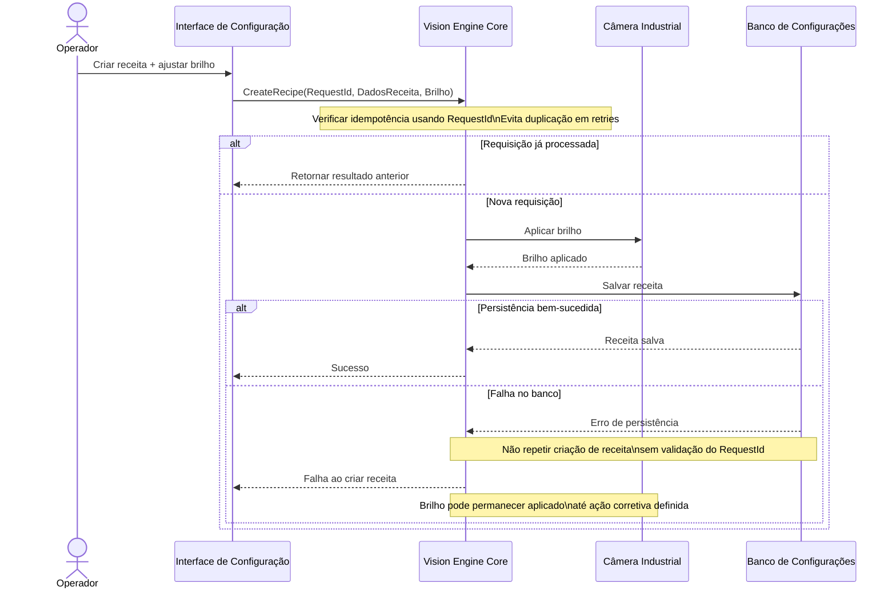

# 1) Lacunas e Perguntas

## Lacunas identificadas

1. Não está definido se o ajuste de brilho da câmera é persistido imediatamente na receita ou apenas aplicado em memória.
2. Não está definido se a criação da receita gera uma nova versão ou sobrescreve uma receita existente.
3. Não está definido como é identificado unicamente um comando de criação de receita para suportar idempotência.
4. Não está definido se a validação dos parâmetros da câmera ocorre antes ou depois da persistência da receita.
5. Não está definido se a ativação de uma receita recém-criada é automática ou depende de ação posterior.
6. Não está definido o comportamento quando a câmera está offline durante o ajuste de brilho.
7. Não está definido se múltiplos usuários podem editar a mesma receita simultaneamente.
8. Não está definido o mecanismo de recuperação quando a gravação da receita falha após o brilho ter sido aplicado na câmera.

## Perguntas de esclarecimento

1. O brilho ajustado deve ser aplicado imediatamente na câmera ou somente após salvar a receita?
2. A criação da receita deve ativá-la automaticamente ao final do fluxo?
3. Existe conceito de versão de receita ou apenas cadastro único?
4. Qual identificador será utilizado para garantir idempotência nos retries (RequestId, UUID, TransactionId etc.)?
5. Caso a câmera não responda, a receita ainda pode ser salva?
6. Deve existir rollback do brilho da câmera quando a persistência da receita falhar?

---

# 2) Roteiro Revisado

**Suposições explícitas**

- O ajuste de brilho é aplicado imediatamente para permitir validação visual do operador.
- A receita somente é considerada criada após persistência bem-sucedida no banco.
- Cada solicitação possui um `RequestId` único para permitir idempotência.
- Não foi assumida tecnologia específica de banco de dados ou protocolo de comunicação.

**Cenário**

1. O Operador utiliza a Interface de Configuração do Vision Engine para criar uma nova receita.
2. A Interface envia os dados da receita e um `RequestId` único ao Core do Vision Engine.
3. O Core valida os parâmetros recebidos e verifica se a requisição já foi processada.
4. O Operador ajusta o brilho de uma câmera associada à receita.
5. O Core envia o novo valor de brilho para a câmera industrial.
6. A câmera confirma a aplicação do parâmetro e passa a fornecer imagens com o novo ajuste.
7. O Core registra a nova receita e suas configurações no banco de dados local.
8. O banco confirma a gravação da receita.
9. O Core retorna sucesso para a Interface, finalizando a criação da receita.
10. Em caso de falha no banco, a receita não é criada, mesmo que o brilho já tenha sido aplicado na câmera.
11. Em um retry, o mesmo `RequestId` deve impedir a criação duplicada da receita.
12. A condição de sucesso é a persistência confirmada da receita e a aplicação válida dos parâmetros de câmera.

---

# 3) Mermaid

### Onde a idempotência é necessária?

| Operação | Necessidade | Motivo |
|-----------|-------------|----------|
| CreateRecipe | Obrigatória | Evitar múltiplos cadastros da mesma receita após timeout ou retry da interface |
| SaveRecipe | Obrigatória | Evitar registros duplicados caso a confirmação do banco se perca |
| ApplyBrightness | Recomendável | O mesmo valor pode ser reaplicado sem alterar o estado final, tornando o retry seguro |

---

# 4) Checklist para Pull Request

1. Existe identificador de idempotência para criação da receita?
2. Retries da Interface reutilizam o mesmo `RequestId`?
3. O fluxo impede criação duplicada quando ocorre timeout entre banco e cliente?
4. A ordem das operações está explícita (aplicar brilho → persistir receita)?
5. O comportamento após falha de persistência está documentado?
6. Existem logs para início, sucesso e falha da criação da receita?
7. Existe correlação de logs por `RequestId`?
8. Erros da câmera e do banco são diferenciados na observabilidade?
9. O fluxo evita estados inconsistentes parcialmente persistidos?
10. O resultado retornado em retries é determinístico?
11. Os efeitos colaterais sobre a câmera estão documentados quando o banco falha?
12. As mensagens de erro permitem identificar rapidamente falhas de infraestrutura versus falhas de validação?
